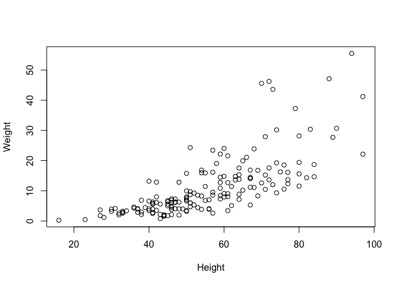
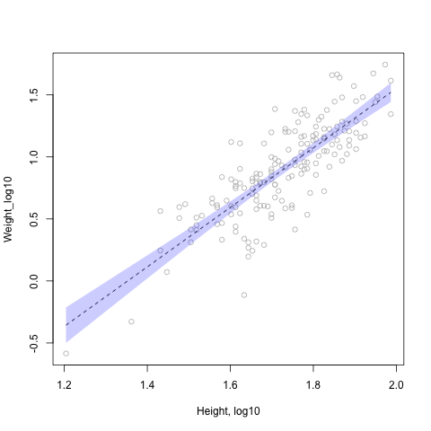

Notebook
================
Me
5/14/2019

## Allometry Project

> How does plant weight scale with height?

  - No relationship
  - Linear
  - To the third power
  - To the second power

## Load our data

``` r
seeds <- read.csv("https://raw.githubusercontent.com/jmadin/himbr/master/data/seed_root_herbivores.csv", as.is=TRUE)
head(seeds)
```

    ##     Plot Seed.herbivore Root.herbivore No.stems Height Weight Seed.heads
    ## 1 plot-2           TRUE           TRUE        1     31   4.16         83
    ## 2 plot-2           TRUE           TRUE        3     41   5.82        175
    ## 3 plot-2           TRUE           TRUE        1     42   3.51         72
    ## 4 plot-2           TRUE          FALSE        1     64   7.16        125
    ## 5 plot-2           TRUE          FALSE        1     47   6.17        212
    ## 6 plot-2           TRUE          FALSE        1     52   5.32        114
    ##   Seeds.in.25.heads
    ## 1                 7
    ## 2                 0
    ## 3                32
    ## 4                22
    ## 5                 3
    ## 6                19

``` r
summary(seeds)
```

    ##      Plot           Seed.herbivore  Root.herbivore     No.stems     
    ##  Length:169         Mode :logical   Mode :logical   Min.   : 1.000  
    ##  Class :character   FALSE:90        FALSE:58        1st Qu.: 1.000  
    ##  Mode  :character   TRUE :79        TRUE :111       Median : 1.000  
    ##                                                     Mean   : 1.982  
    ##                                                     3rd Qu.: 3.000  
    ##                                                     Max.   :10.000  
    ##      Height          Weight        Seed.heads     Seeds.in.25.heads
    ##  Min.   :16.00   Min.   : 0.26   Min.   :   3.0   Min.   :  0.00   
    ##  1st Qu.:44.00   1st Qu.: 4.08   1st Qu.:  93.0   1st Qu.: 10.00   
    ##  Median :54.00   Median : 8.05   Median : 175.0   Median : 19.00   
    ##  Mean   :55.54   Mean   :11.20   Mean   : 225.8   Mean   : 22.13   
    ##  3rd Qu.:67.00   3rd Qu.:14.77   3rd Qu.: 303.0   3rd Qu.: 32.00   
    ##  Max.   :97.00   Max.   :55.51   Max.   :1003.0   Max.   :100.00

## A function for standard error

``` r
standard_error <- function(x) {
  se <- sd(x) / sqrt(length(x))
  return(se)
}
```

## Seed height/weight plotting

``` r
plot(Weight ~ Height, data=seeds)
```

<!-- -->

## Data transformation

``` r
seeds$Weight_log10 <- log10(seeds$Weight)
seeds$Height_log10 <- log10(seeds$Height)
```

## Data analysis

We will run a linear regression on log-transformed variables to look for
scaling coefficient.

``` r
mod <- lm(Weight_log10 ~ Height_log10, data=seeds)
summary(mod)
```

    ## 
    ## Call:
    ## lm(formula = Weight_log10 ~ Height_log10, data = seeds)
    ## 
    ## Residuals:
    ##      Min       1Q   Median       3Q      Max 
    ## -0.78676 -0.13950  0.01404  0.12981  0.53483 
    ## 
    ## Coefficients:
    ##              Estimate Std. Error t value Pr(>|t|)    
    ## (Intercept)   -3.2440     0.2330  -13.92   <2e-16 ***
    ## Height_log10   2.3981     0.1346   17.81   <2e-16 ***
    ## ---
    ## Signif. codes:  0 '***' 0.001 '**' 0.01 '*' 0.05 '.' 0.1 ' ' 1
    ## 
    ## Residual standard error: 0.2286 on 167 degrees of freedom
    ## Multiple R-squared:  0.6552, Adjusted R-squared:  0.6531 
    ## F-statistic: 317.3 on 1 and 167 DF,  p-value: < 2.2e-16

``` r
mod$coef
```

    ##  (Intercept) Height_log10 
    ##    -3.243954     2.398089

``` r
write.csv(mod$coef, "output/model_coefs.csv")
```

## Figure

``` r
h <- sort(seeds$Height_log10)
pred <- predict(mod, list(Height_log10=h), interval="confidence")

png("figs/figure1.png")

plot(Weight_log10 ~ Height_log10, data=seeds, xlab="Height, log10", col="grey")
lines(h, pred[,1], col="black", lty=2)
polygon(c(h, rev(h)), c(pred[,2], rev(pred[,3])), col=rgb(0, 0, 1, 0.2), border=NA)

dev.off()
```

    ## quartz_off_screen 
    ##                 2

My final plot:  


## Conclusions

The slope of the relationship between height and weight is 2.4.
